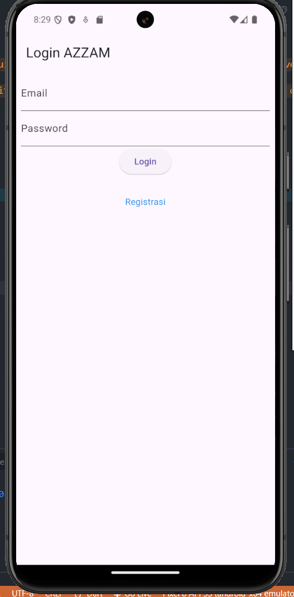
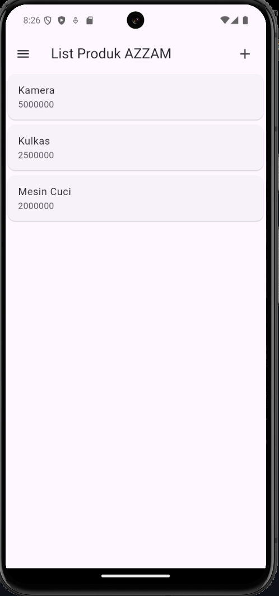
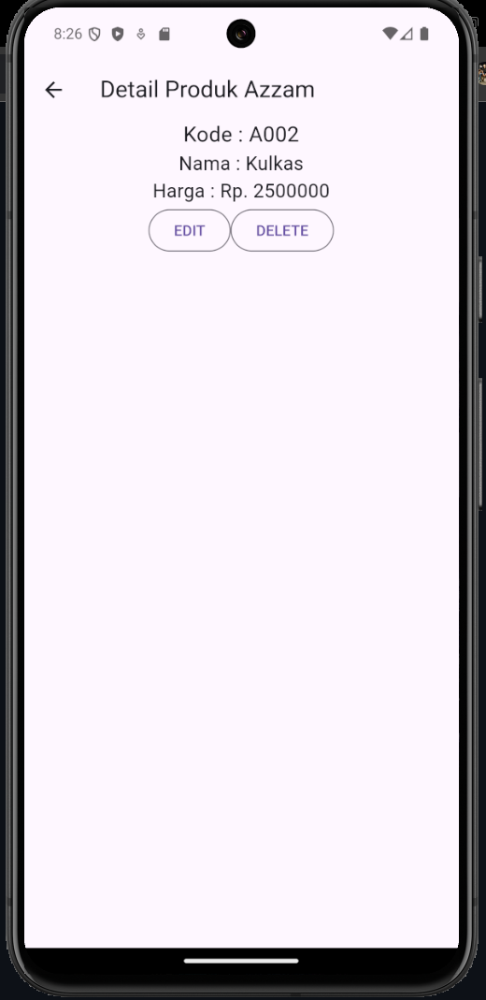
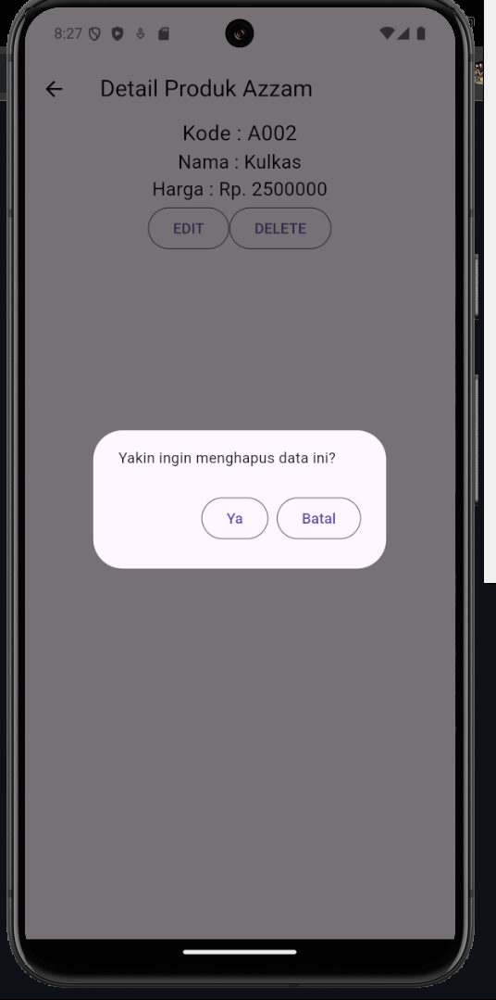
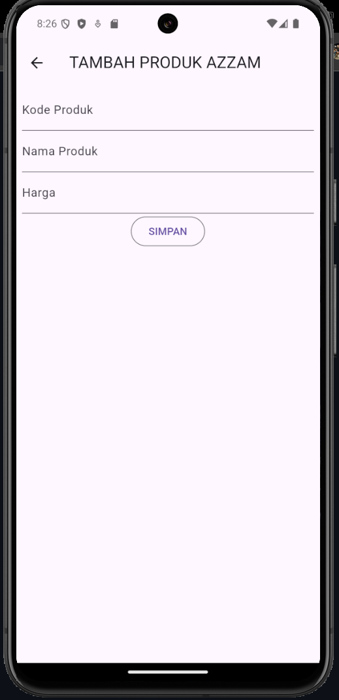
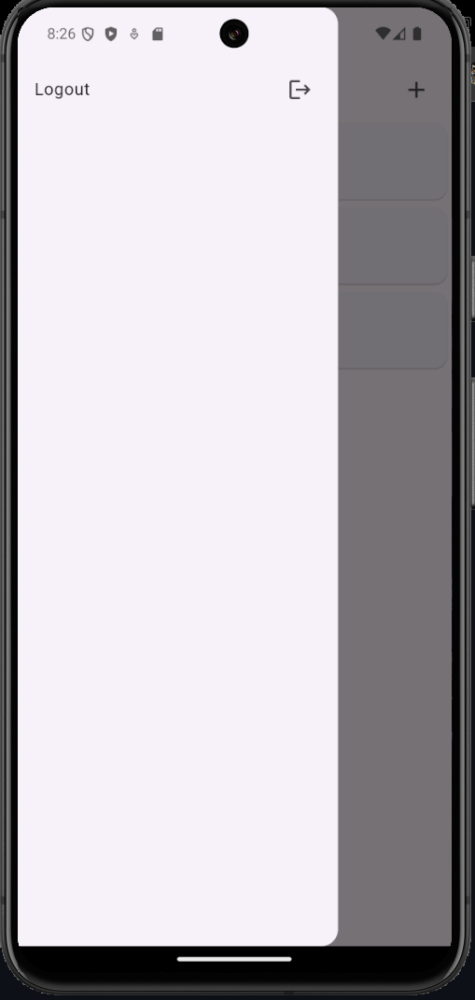
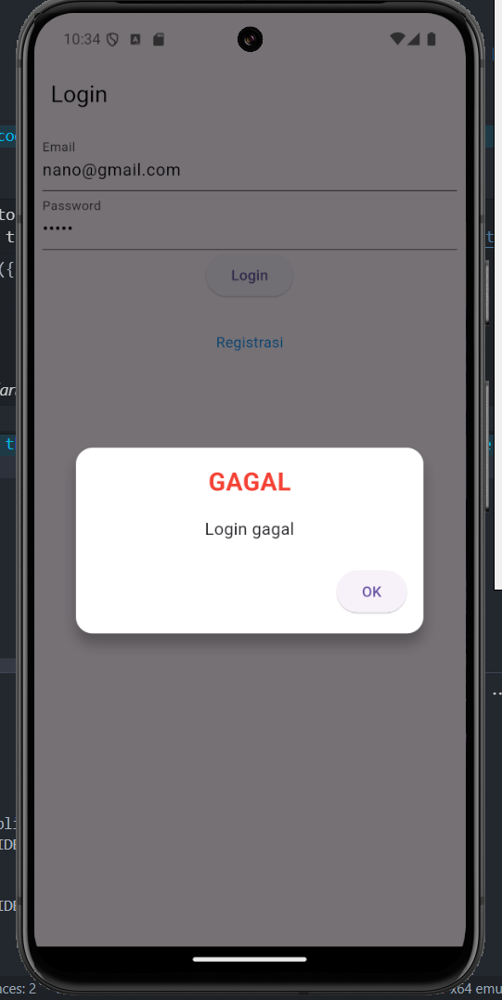

# Tugas Pertemuan 4
tokokita

Nama: Azzam Dicky Umar Widadi 
NIM: H1D022090  
Shift KRS: D
Shift Baru: F

## Screenshot
1. Gambar login <br>
<br>
2. Gambar registrasi <br>
<br>
3. Gambar list<br>
<br>
4. Gambar detail <br>
<br>
5. Gambar edit produk <br>
<br>
6. Gambar hapus produk <br>
<br>
7. Gambar tambah produk <br>
<br>
8. Gambar sidemenu <br>
<br>

# Tugas Pertemuan 5
Terdapat folder helpers yangb berisi file-file yang digunakan untuk menangani komunikasi API, menangani kesalahan, serta pengelolaan data pengguna seperti token untuk autentikasi.
## 1. file `api_url.dart`
File ini berfungsi sebagai penyimpan URL endpoint API yang akan digunakan dalam aplikasi. Dengan menggunakan kelas ApiUrl, aplikasi dapat mengakses endpoint API dengan lebih mudah, tanpa harus menuliskan URL secara langsung di setiap tempat. Di dalamnya terdapat URL dasar (`baseUrl`) yang mengarah ke server API, serta berbagai endpoint untuk operasi CRUD pada produk, serta autentikasi pengguna (registrasi dan login).
## 2. file `api.dart`
File ini bertanggung jawab untuk melakukan permintaan HTTP (request) ke API. Ini termasuk metode POST, GET, PUT, dan DELETE yang digunakan untuk mengirim dan menerima data dari API. Juga menangani error jika terjadi masalah komunikasi dengan server.
## 3. file `app_exception.dart`
File ini menangani pembuatan kelas-kelas exception khusus yang mewakili berbagai jenis kesalahan yang mungkin terjadi selama komunikasi dengan server. Ini memudahkan penanganan error agar aplikasi dapat memberikan pesan error yang lebih spesifik dan informatif. Kelas-kelas yang ada seperti `FetchDataException`, `BadRequestException`, `UnauthorisedException`, dan lainnya digunakan untuk memberikan pesan kesalahan yang spesifik seperti "Error During Communication", "Invalid Request", atau "Unauthorised", berdasarkan situasi yang terjadi.
## 4. file `user_info.dart`
File ini digunakan untuk mengelola data pengguna seperti token autentikasi dan ID pengguna yang disimpan menggunakan `SharedPreferences`. Data ini memungkinkan aplikasi menyimpan informasi penting secara lokal dan tetap tersedia walaupun aplikasi ditutup.
setToken: Menyimpan token autentikasi.
getToken`: Mengambil token autentikasi.
setUserID`: Menyimpan ID pengguna.
getUserID`: Mengambil ID pengguna.
logout: Menghapus semua data pengguna dari SharedPreferences, biasanya digunakan saat pengguna melakukan logout.

# A. Halaman Registrasi

pada halaman registrasi akan memproses data yang telah diisi dan akan memanggil method `_submit()` untuk didaftarkan dan masuk ke database
```dart
void _submit() {
    _formKey.currentState!.save();
    setState(() {
      _isLoading = true;
    });
    RegistrasiBloc.registrasi(
        nama: _namaTextboxController.text,
        email: _emailTextboxController.text,
        password: _passwordTextboxController.text)
        .then((value) {
      showDialog(
          context: context,
          barrierDismissible: false,
          builder: (BuildContext context) => SuccessDialog(
            description: "Registrasi berhasil, silahkan login",
            okClick: () {
              Navigator.pop(context);
            },
          ));
    }, onError: (error) {
      showDialog(
          context: context,
          barrierDismissible: false,
          builder: (BuildContext context) => const WarningDialog(
            description: "Registrasi gagal, silahkan coba lagi",
          ));
    });
    setState(() {
      _isLoading = false;
    });
}
```

#### file `registrasi_bloc.dart`
Untuk mengelola logika registrasi user dalam aplikasi, yang terhubung dengan API untuk memproses data.
```dart
class RegistrasiBloc {
  static Future<Registrasi> registrasi({String? nama, String? email, String? password}) async {
    String apiUrl = ApiUrl.registrasi;
    var body = {"nama": nama, "email": email, "password": password};
    var response = await Api().post(apiUrl, body);
    var jsonObj = json.decode(response.body);
    return Registrasi.fromJson(jsonObj);
  }
}
```

#### file `registrasi.dart` pada folder `model`
digunakan memetakan data respons dari API (seperti kode status, status sukses/gagal, dan data pesan) ke dalam bentuk objek Dart yang mudah digunakan dalam logika aplikasi.
```dart
class Registrasi {
  int? code;
  bool? status;
  String? data;

  Registrasi({this.code, this.status, this.data});

  factory Registrasi.fromJson(Map<String, dynamic> obj) {
    return Registrasi(
    code: obj['code'],
    status: obj['status'],
    data: obj['data']);
  }
}
```


# B. Halaman Login

akan dilakukan validasi form jika valis maka `_submit()` dipanggil `LoginBloc.login()`. Jika login berhasil, token dan userID disimpan, dan masuk ke `ProdukPage`. Apabila gbabgal akan muncul messagbe error.
```dart
Widget _buttonLogin() {
    return ElevatedButton(
      child: const Text("Login"),
      onPressed: () {
        var validate = _formKey.currentState!.validate();
        if (validate) {
          if (!_isLoading) _submit();
        }
      },
    );
  }

  void _submit() {
    _formKey.currentState!.save();
    setState(() {
      _isLoading = true;
    });
    LoginBloc.login(
        email: _emailTextboxController.text,
        password: _passwordTextboxController.text
    ).then((value) async {
      print("Login successful: $value");
      if (value.userID != null) {
        await UserInfo().setToken(value.token ?? "");
        await UserInfo().setUserID(value.userID!);
        Navigator.pushReplacement(context,
            MaterialPageRoute(builder: (context) => const ProdukPage()));
      } else {
        throw Exception("UserID is null");
      }
    }).catchError((error) {
      print("Login error: $error");
      showDialog(
          context: context,
          barrierDismissible: false,
          builder: (BuildContext context) => WarningDialog(
            description: "Login gagal: ${error.toString()}",
          )
      );
    }).whenComplete(() {
      setState(() {
        _isLoading = false;
      });
    });
  }
```
#### file `login.dart` pada folder model
```dart
class Login {
  int? code;
  bool? status;
  String? token;
  int? userID;
  String? userEmail;

  Login({this.code, this.status, this.token, this.userID, this.userEmail});

  factory Login.fromJson(Map<String, dynamic> obj) {
    print(obj);  // Tambahkan ini untuk melihat struktur JSON yang diterima
    return Login(
        code: obj['code'],
        status: obj['status'],
        token: obj['data']['token'],
        userID: int.tryParse(obj['data']['user']['id'].toString()),  // Ubah ini
        userEmail: obj['data']['user']['email']
    );
  }
}
```
#### file `login_bloc.dart` pada folder model
```dart
import 'dart:convert';
import 'package:tokokita/helpers/api.dart';
import 'package:tokokita/helpers/api_url.dart';
import 'package:tokokita/model/login.dart';
class LoginBloc {
  static Future<Login> login({String? email, String? password}) async {
    String apiUrl = ApiUrl.login;
    var body = {"email": email, "password": password};
    var response = await Api().post(apiUrl, body);
    var jsonObj = json.decode(response.body);
    return Login.fromJson(jsonObj);
  }
}
```



# C. Halaman Tambah Data


#### file `produk.dart` folder `model`
```dart
class Produk {
  String? id;
  String? kodeProduk;
  String? namaProduk;
  var hargaProduk;
  Produk({this.id, this.kodeProduk, this.namaProduk, this.hargaProduk});
  factory Produk.fromJson(Map<String, dynamic> obj) {
    return Produk(
        id: obj['id'],
        kodeProduk: obj['kode_produk'],
        namaProduk: obj['nama_produk'],
        hargaProduk: obj['harga']);}
}
```

#### file `produk_bloc.dart` folder `bloc`
Untuk menambah produk, akan memangbgbil fungsi `addProduk()` pada class `ProdukBloc`
```dart
class ProdukBloc {
  static Future addProduk({Produk? produk}) async {
    String apiUrl = ApiUrl.createProduk;
    var body = {
      "kode_produk": produk!.kodeProduk,
      "nama_produk": produk.namaProduk,
      "harga": produk.hargaProduk.toString()
    };
    var response = await Api().post(apiUrl, body);
    var jsonObj = json.decode(response.body);
    return jsonObj['status'];
  }
}
```
# D. Halaman Menampilkan Data


untuk menampilkan menggunakan `getProduks()`
```dart
class ProdukBloc {
  static Future<List<Produk>> getProduks() async {
    String apiUrl = ApiUrl.listProduk;
    var response = await Api().get(apiUrl);
    var jsonObj = json.decode(response.body);
    List<dynamic> listProduk = (jsonObj as Map<String, dynamic>)['data'];
    List<Produk> produks = [];
    for (int i = 0; i < listProduk.length; i++) {
      produks.add(Produk.fromJson(listProduk[i]));
    }
    return produks;
  }
}
```
# E. Halaman Edit Data


ketika button edit ditekan maka akan masuk ke `ProdukForm` dan diedit dan kembali ke `ProdukPage` dengan data yang baru
```dart
OutlinedButton(
  child: const Text("EDIT"),
  onPressed: () {
    Navigator.push(
      context,
      MaterialPageRoute(
        builder: (context) => ProdukForm(
          produk: widget.produk!,
        ),
      ),
    );
  },
),
```

```dart
static Future updateProduk({required Produk produk}) async {
    String apiUrl = ApiUrl.updateProduk(int.parse(produk.id!));
    print(apiUrl);
    var body = {
      "kode_produk": produk.kodeProduk,
      "nama_produk": produk.namaProduk,
      "harga": produk.hargaProduk.toString()
    };
    print("Body : $body");
    var response = await Api().put(apiUrl, jsonEncode(body));
    var jsonObj = json.decode(response.body);
    return jsonObj['status'];
  }
```

# F. Halaman Hapus Data


proses delete dikonfirmasi melalui `ProdukBloc.deleteProduk()` apabila telah dikonfirmasi hapus maka akan diarahkan ke halaman `ProdukPage`
```dart
void confirmHapus() {AlertDialog alertDialog = AlertDialog(
  content: const Text("Yakin ingin menghapus data ini?"),
  actions: [
//tombol hapus
    OutlinedButton(
      child: const Text("Ya"),
      onPressed: () {
        ProdukBloc.deleteProduk(id: int.parse(widget.produk!.id!)).then(
                (value) => {
              Navigator.of(context).push(MaterialPageRoute(
                  builder: (context) => const ProdukPage()))
            }, onError: (error) {
          showDialog(
              context: context,
              builder: (BuildContext context) => const WarningDialog(
                description: "Hapus gagal, silahkan coba lagi",
              ));
        });
      },
    ),
//tombol batal
    OutlinedButton(
      child: const Text("Batal"),
      onPressed: () => Navigator.pop(context),
    )
  ],
);
showDialog(builder: (context) => alertDialog, context: context);
}
```
```dart
static Future<bool> deleteProduk({int? id}) async {
    String apiUrl = ApiUrl.deleteProduk(id!);
    var response = await Api().delete(apiUrl);
    var jsonObj = json.decode(response.body);
    return (jsonObj as Map<String, dynamic>)['data'];
}
```
# G. Halaman logout

class `LogoutBloc` membantu prosess logout. Setelah akan diarahkan ke halaman login.
```dart
class LogoutBloc {
  static Future logout() async {
    await UserInfo().logout();
  }
}
```